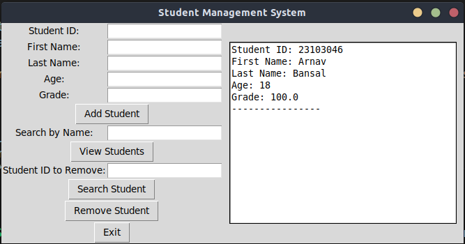

# Student-Management-System
📚 Student Management System: Python &amp; Tkinter GUI for adding, viewing, searching, and removing student records. Easy student data management!
# Student Management System




## Table of Contents

- [Features](#features)
- [Dependencies](#dependencies)
- [Usage](#usage)
- [Functionality](#functionality)
  - [Add a New Student](#add-a-new-student)
  - [View All Students](#view-all-students)
  - [Search for a Student by Name](#search-for-a-student-by-name)
  - [Remove a Student](#remove-a-student)
  - [Exit the Program](#exit-the-program)
- [Contributing](#contributing)
- [License](#license)

## Features

- Add new student records with unique Student ID.
- View all student records.
- Search for a student by their name.
- Remove a student record by Student ID.
- Data is stored in memory and can be saved to a CSV file.

## Dependencies

This project uses the following dependencies:

- Python (>=3.6)
- Tkinter (Python GUI library, usually included in Python installations)

## Usage

1. Clone this repository to your local machine:

   ```shell
   git clone https://github.com/yourusername/student-management-system.git
